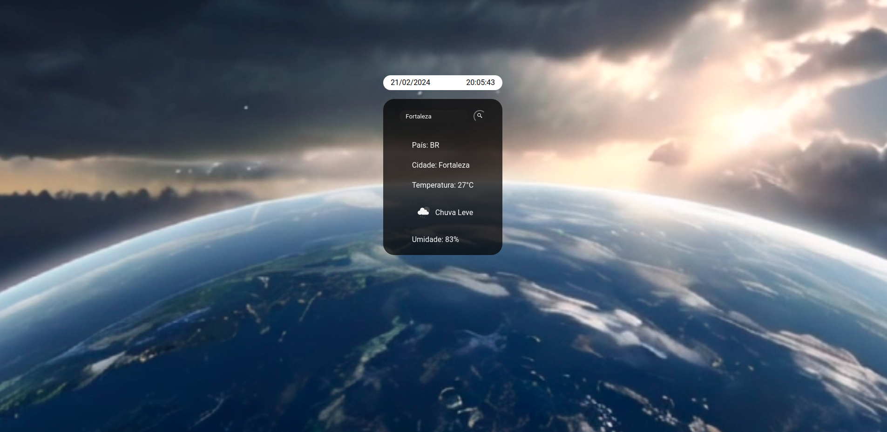

<h1>
Projeto JavaScript com API em Tempo Real usando Fetch!
</h1>

Acabei de concluir um projeto incrível em JavaScript que utiliza uma API em tempo real para fornecer dados atualizados instantaneamente! ⚡️

O projeto foi desenvolvido usando a ferramenta fetch, que simplifica o processo de comunicação com APIs e torna o código mais limpo e eficiente.

<h2>
Com este projeto, pude aprimorar minhas habilidades em:
</h2>
<ul>
<li>JavaScript: Domínio da linguagem e suas nuances.</li>
<li>APIs em Tempo Real: Implementação de comunicação bidirecional para atualizações instantâneas.</li>
<li>Fetch: Utilização da ferramenta para requisições HTTP assíncronas de forma eficiente.</li>
<li>Estou muito empolgado com o resultado e ansioso para aplicar esse conhecimento em futuros projetos!</li>
</ul>

 # Clima
